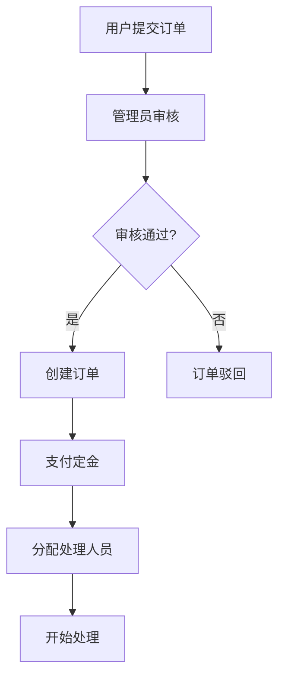
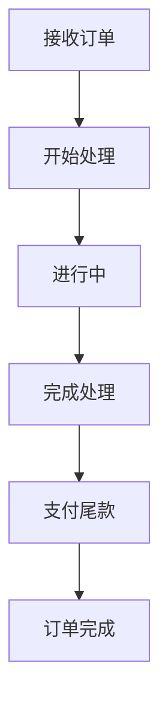
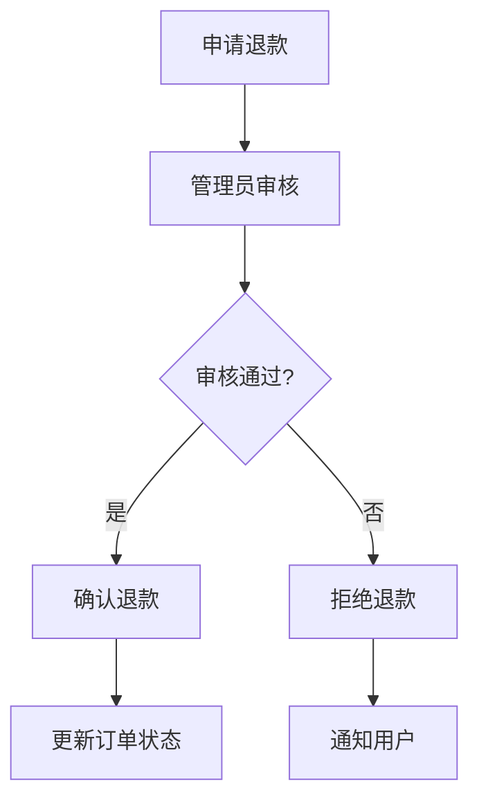

# 神笔马良论文订单OA管理系统

## 📋 模块概述

论文OA业务模块是基于SmartAdmin框架开发的论文订单管理系统，专门用于管理论文写作、修改、润色、翻译等学术服务订单。该模块提供了完整的订单生命周期管理，包括订单创建、分配、处理、支付、退款等核心功能。

## 🎯 开发团队
- 神笔马良论文工作室出品
- <h4><a href="https://work.weixin.qq.com/kfid/kfc2a000aafc616da31" rel="nofollow" _istranslated="1">点击跳转微信客服</a></h4>
- <h4>后续AI论文生成系统也会开源（含自研论文算法；aigc论文降重算法）</h4>
- <h4>后续AI论文生成系统也会开源（含自研论文算法；aigc论文降重算法）</h4>
- <h4>后续AI论文生成系统也会开源（含自研论文算法；aigc论文降重算法）</h4>
- <h4>预计2025/9/10日12:00前公开AI论文生成系统源码仓库</h4>

## 🏗️ 系统架构
### 系统演示图

#### 1. 管理员订单管理界面


**功能特点：**
- 完整的订单列表展示，支持多条件筛选
- 订单状态实时显示（待处理、进行中、已完成、已取消）
- 支持批量操作和单个订单管理
- 订单分配和状态更新功能

#### 2. 订单编辑界面


**功能特点：**
- 表单验证和字段校验
- 文件上传功能
- 自动计算尾款金额
- 负责人选择和分配

#### 3. 订单分配界面


**功能特点：**
- 员工选择下拉框
- 分配备注记录
- 批量分配支持
- 分配历史追踪

#### 4. 订单详情界面


**功能特点：**
- 完整的订单信息展示
- 支付状态和金额显示
- 时间节点记录
- 附件管理

#### 5. 退款申请界面


**功能特点：**
- 退款金额计算
- 退款原因说明
- 最大可退款金额提示
- 退款流程跟踪

#### 6. 用户订单处理界面


**功能特点：**
- 个人订单列表
- 状态更新功能
- 订单详情查看
- 处理进度跟踪

#### 7. 订单状态更新界面


**功能特点：**
- 状态选择下拉框
- 状态变更记录
- 备注信息添加
- 状态历史追踪

#### 8. 员工统计界面


**功能特点：**
- 员工工作量统计
- 接单数量分析
- 完成率计算
- 绩效评估

#### 9. 数据统计仪表盘

### 技术栈
- **后端**: SpringBoot 3.5.4 + MyBatis-Plus + Sa-Token
- **前端**: Vue 3.4.27 + Vite 5.2.12 + Ant Design Vue 4.X
- **数据库**: MySQL 8.0+ / PostgreSQL 12+ / 国产数据库
- **图表**: ECharts 5.x
- **权限**: Sa-Token权限框架

### 模块结构
```
论文OA业务模块
├── 后端模块 (smart-admin-api-java17-springboot3/sa-admin/src/main/java/net/lab1024/sa/admin/module/oa/paperorder/)
│   ├── controller/          # 控制器层
│   ├── service/            # 服务层
│   ├── manager/            # 管理层
│   ├── dao/                # 数据访问层
│   ├── domain/             # 领域对象
│   │   ├── entity/         # 实体类
│   │   ├── form/           # 表单类
│   │   └── vo/             # 视图对象
│   └── config/             # 配置类
├── 前端模块 (smart-admin-web-javascript/src/views/oa/paper-order/)
│   ├── admin/              # 管理员页面
│   ├── user/               # 用户页面
│   ├── dashboard/          # 数据统计页面
│   ├── components/         # 组件
│   └── test/               # 测试页面
└── 数据库设计
    ├── 论文订单管理系统.sql
    └── 论文订单管理系统菜单配置.sql
```

## 🎯 核心功能

### 1. 订单管理功能

#### 1.1 订单CRUD操作
- **新增订单**: 支持论文写作、修改、润色、翻译四种任务类型
- **编辑订单**: 修改订单基本信息、状态、负责人等
- **删除订单**: 软删除机制，支持数据恢复
- **查询订单**: 多条件组合查询，支持分页和排序

#### 1.2 订单分配功能
- **单个分配**: 将订单分配给指定处理人员
- **批量分配**: 支持批量选择订单进行分配
- **智能分配**: 根据工作负载自动推荐分配对象

#### 1.3 订单状态管理
- **状态流转**: 待处理 → 进行中 → 已完成 → 已取消
- **状态日志**: 记录每次状态变更的时间和操作人
- **状态权限**: 不同角色具有不同的状态修改权限

### 2. 支付管理功能

#### 2.1 支付状态跟踪
- **定金支付**: 订单创建时支付定金
- **尾款支付**: 任务完成后支付尾款
- **支付确认**: 管理员确认收款状态

#### 2.2 退款管理
- **退款申请**: 用户可申请退款
- **退款审核**: 管理员审核退款申请
- **退款确认**: 确认退款并更新订单状态
- **退款记录**: 完整的退款流程记录

### 3. 数据统计功能

#### 3.1 实时统计
- **今日订单数**: 实时统计当日新增订单
- **今日完成数**: 实时统计当日完成订单
- **今日收款**: 实时统计当日收款金额
- **昨日对比**: 与昨日数据进行对比分析

#### 3.2 员工统计
- **个人订单统计**: 每个员工的订单处理情况
- **工作量分析**: 员工工作负载和效率分析
- **绩效评估**: 基于订单完成情况的绩效评估

#### 3.3 图表展示
- **趋势图表**: 订单数量趋势分析
- **状态分布**: 订单状态分布饼图
- **类型统计**: 任务类型分布统计

## 📊 数据库设计

### 核心表结构

#### 1. 论文订单表 (t_paper_order)
```sql
CREATE TABLE t_paper_order (
    order_id BIGINT PRIMARY KEY AUTO_INCREMENT COMMENT '订单ID',
    order_no VARCHAR(50) NOT NULL COMMENT '订单编号',
    paper_name VARCHAR(200) NOT NULL COMMENT '论文名称',
    task_type INT NOT NULL COMMENT '任务类型：1论文写作 2论文修改 3论文润色 4论文翻译',
    task_status INT NOT NULL DEFAULT 1 COMMENT '任务状态：1待处理 2进行中 3已完成 4已取消',
    subject INT NOT NULL DEFAULT 1 COMMENT '学科：1文科 2理科',
    word_count INT DEFAULT 0 COMMENT '论文字数',
    expected_end_time DATETIME COMMENT '预计结束时间',
    actual_start_time DATETIME COMMENT '实际开始时间',
    actual_end_time DATETIME COMMENT '实际结束时间',
    assignee_id BIGINT COMMENT '负责人ID',
    assignee_name VARCHAR(50) COMMENT '负责人姓名',
    expected_amount DECIMAL(10,2) COMMENT '总额',
    actual_amount DECIMAL(10,2) COMMENT '定金',
    unpaid_amount DECIMAL(10,2) COMMENT '尾款（自动计算）',
    payment_status INT DEFAULT 0 COMMENT '支付状态：0未支付 1已付定金 2已付全款',
    refund_status INT DEFAULT 0 COMMENT '退款状态：0无退款 1申请退款 2已退款',
    refund_amount DECIMAL(10,2) COMMENT '退款金额',
    refund_reason VARCHAR(500) COMMENT '退款原因',
    refund_remark VARCHAR(1000) COMMENT '退款备注',
    refund_apply_time DATETIME COMMENT '退款申请时间',
    refund_apply_user_id BIGINT COMMENT '退款申请用户ID',
    refund_confirm_time DATETIME COMMENT '退款确认时间',
    refund_confirm_user_id BIGINT COMMENT '退款确认用户ID',
    task_description TEXT COMMENT '任务描述',
    remark VARCHAR(1000) COMMENT '备注',
    attachment_url VARCHAR(500) COMMENT '附件URL',
    attachment_name VARCHAR(200) COMMENT '附件名称',
    create_user_id BIGINT NOT NULL COMMENT '创建人ID',
    create_time DATETIME NOT NULL DEFAULT CURRENT_TIMESTAMP COMMENT '创建时间',
    update_time DATETIME NOT NULL DEFAULT CURRENT_TIMESTAMP ON UPDATE CURRENT_TIMESTAMP COMMENT '更新时间',
    deleted_flag TINYINT NOT NULL DEFAULT 0 COMMENT '删除标识：0未删除 1已删除'
);
```

#### 2. 订单编号生成表 (t_order_no_generator)
```sql
CREATE TABLE t_order_no_generator (
    id BIGINT PRIMARY KEY AUTO_INCREMENT,
    order_no VARCHAR(50) NOT NULL UNIQUE COMMENT '订单编号',
    create_time DATETIME NOT NULL DEFAULT CURRENT_TIMESTAMP COMMENT '创建时间'
);
```

### 索引设计
```sql
-- 订单表索引
CREATE INDEX idx_order_no ON t_paper_order(order_no);
CREATE INDEX idx_task_status ON t_paper_order(task_status);
CREATE INDEX idx_assignee_id ON t_paper_order(assignee_id);
CREATE INDEX idx_create_time ON t_paper_order(create_time);
CREATE INDEX idx_payment_status ON t_paper_order(payment_status);
CREATE INDEX idx_refund_status ON t_paper_order(refund_status);
CREATE INDEX idx_deleted_flag ON t_paper_order(deleted_flag);
```

## 🔐 权限设计

### 菜单权限结构
```
论文订单管理 (主菜单)
├── 订单管理 (管理员页面)
│   ├── 新增订单 (paper:order:add)
│   ├── 编辑订单 (paper:order:update)
│   ├── 删除订单 (paper:order:delete)
│   ├── 分配订单 (paper:order:assign)
│   ├── 批量分配 (paper:order:batch-assign)
│   ├── 查看详情 (paper:order:detail)
│   └── 导出订单 (paper:order:export)
├── 我的订单 (用户页面)
│   ├── 修改订单状态 (paper:order:update-status)
│   └── 查看订单详情 (paper:order:detail)
└── 数据统计 (统计页面)
    ├── 刷新统计 (paper:order:statistics)
    └── 导出统计 (paper:order:export-statistics)
```

### 角色权限
- **论文订单管理员**: 拥有所有菜单和按钮权限
- **论文订单处理员**: 拥有用户相关权限和统计查看权限
- **论文订单查看员**: 仅拥有查看权限

## 🚀 API接口设计

### 管理员接口
```java
// 订单管理
POST /paper-order/admin/query          // 分页查询订单
POST /paper-order/add                  // 新增订单
POST /paper-order/update               // 更新订单
POST /paper-order/delete                // 删除订单
POST /paper-order/assign                // 分配订单
POST /paper-order/batch-assign          // 批量分配订单
GET  /paper-order/detail/{orderId}      // 获取订单详情

// 支付管理
POST /paper-order/payment/confirm       // 确认支付
POST /paper-order/refund/apply          // 申请退款
POST /paper-order/refund/confirm        // 确认退款

// 统计查询
GET  /paper-order/statistics            // 获取统计数据
GET  /paper-order/employee-statistics   // 获取员工统计
```

### 用户接口
```java
// 订单处理
POST /paper-order/user/query            // 用户查询订单
POST /paper-order/status/update         // 更新订单状态
GET  /paper-order/user/detail/{orderId} // 获取订单详情
```

## 🎨 前端组件设计

### 核心组件

#### 1. 订单表单组件 (PaperOrderFormModal)
- **功能**: 新增/编辑订单
- **特性**: 表单验证、文件上传、动态计算
- **字段**: 论文名称、任务类型、学科、字数、预计时间、金额等

#### 2. 订单分配组件 (PaperOrderAssignModal)
- **功能**: 订单分配和批量分配
- **特性**: 员工选择、工作负载显示、智能推荐
- **权限**: 仅管理员可操作

#### 3. 订单详情组件 (PaperOrderDetailModal)
- **功能**: 查看订单详细信息
- **特性**: 状态历史、支付记录、退款记录
- **权限**: 根据角色显示不同信息

#### 4. 支付管理组件 (PaperOrderPaymentModal)
- **功能**: 支付确认和退款处理
- **特性**: 金额计算、状态更新、操作记录
- **权限**: 管理员专用

#### 5. 数据统计组件 (PaperOrderDashboard)
- **功能**: 实时数据统计和图表展示
- **特性**: 自动刷新、数据对比、图表交互
- **图表**: ECharts柱状图、饼图、折线图

### 页面结构

#### 1. 管理员页面 (admin/index.vue)
```vue
<template>
  <div class="paper-order-admin">
    <!-- 查询表单 -->
    <a-form :model="queryForm" layout="inline">
      <!-- 查询条件 -->
    </a-form>
    
    <!-- 操作按钮 -->
    <div class="table-operator">
      <a-button type="primary" @click="handleAdd">新增订单</a-button>
      <a-button @click="handleBatchAssign">批量分配</a-button>
    </div>
    
    <!-- 数据表格 -->
    <a-table :columns="columns" :data-source="dataSource">
      <!-- 表格列定义 -->
    </a-table>
  </div>
</template>
```

#### 2. 用户页面 (user/index.vue)
```vue
<template>
  <div class="paper-order-user">
    <!-- 我的订单列表 -->
    <a-table :columns="userColumns" :data-source="userOrders">
      <!-- 用户操作列 -->
    </a-table>
  </div>
</template>
```

#### 3. 统计页面 (dashboard/index.vue)
```vue
<template>
  <div class="paper-order-dashboard">
    <!-- 统计卡片 -->
    <a-row :gutter="16">
      <a-col :span="6">
        <a-card>
          <a-statistic title="今日订单数" :value="statistics.todayOrderCount" />
        </a-card>
      </a-col>
    </a-row>
    
    <!-- 图表区域 -->
    <a-row :gutter="16">
      <a-col :span="12">
        <a-card title="订单趋势">
          <div ref="trendChart" style="height: 300px;"></div>
        </a-card>
      </a-col>
    </a-row>
  </div>
</template>
```

## 🔧 配置说明

### 后端配置
```yaml
# application-dev.yml
spring:
  datasource:
    url: jdbc:mysql://localhost:3306/smart_admin_oa
    username: root
    password: your_password

# 文件上传配置
smart:
  file:
    upload-path: /uploads/paper-order/
    max-file-size: 10MB

# 订单配置
paper-order:
  order-no-prefix: "PO"
  max-batch-assign: 50
```

### 前端配置
```javascript
// .env.development
VITE_API_BASE_URL=http://localhost:8080
VITE_UPLOAD_URL=http://localhost:8080/file/upload
VITE_PAPER_ORDER_CONFIG={
  "maxFileSize": "10MB",
  "allowedFileTypes": [".doc", ".docx", ".pdf"],
  "autoRefreshInterval": 30000
}
```

## 📈 业务流程

### 订单创建流程


### 订单处理流程


### 退款处理流程


## 🛠️ 开发指南

### 环境要求
- **Java**: 17+
- **Node.js**: 16+
- **数据库**: MySQL 8.0+ / PostgreSQL 12+
- **Maven**: 3.6+
- **IDE**: IDEA / VS Code

### 部署步骤

#### 1. 数据库初始化
```bash
# 创建数据库
CREATE DATABASE smart_admin_oa DEFAULT CHARACTER SET utf8mb4 COLLATE utf8mb4_unicode_ci;

# 执行建表脚本
mysql -u root -p smart_admin_oa < 数据库设计/论文订单管理系统.sql

# 执行菜单配置
mysql -u root -p smart_admin_oa < 数据库设计/论文订单管理系统菜单配置.sql
```

#### 2. 后端部署
```bash
上传jar文件进行启动
```

#### 3. 前端部署
```bash
二、修改url
根据打包环境，修改如下：
.env.test 测试环境
.env.pre  预发布环境
.env.prod 生产环境
只需修改".env"文件中的 VITE_APP_API_URL 和 VITE_APP_TITLE，如下：

VITE_APP_API_URL = 'https://gz.1024lab.net/smart-admin-api'

VITE_APP_TITLE = '神笔马良论文订单OA管理系统'
```
```bash
cd smart-admin-web-javascript
npm install
npm run dev
```

### 开发规范

#### 1. 代码规范
- **Java**: 遵循阿里巴巴Java开发手册
- **Vue**: 遵循Vue 3 Composition API规范
- **SQL**: 遵循MySQL命名规范

#### 2. 接口规范
- **RESTful**: 遵循REST API设计原则
- **响应格式**: 统一使用ResponseDTO包装
- **异常处理**: 统一异常处理机制

#### 3. 数据库规范
- **命名**: 表名使用t_前缀，字段使用下划线命名
- **索引**: 合理创建索引，避免全表扫描
- **事务**: 合理使用事务，保证数据一致性

## 🔍 测试指南

### 单元测试
```java
@SpringBootTest
class PaperOrderServiceTest {
    
    @Test
    void testAddOrder() {
        // 测试新增订单功能
    }
    
    @Test
    void testAssignOrder() {
        // 测试订单分配功能
    }
}
```

### 集成测试
```javascript
// 前端组件测试
describe('PaperOrderFormModal', () => {
  it('should validate form fields', () => {
    // 测试表单验证
  });
});
```

### 接口测试
```bash
# 使用Postman或curl测试API
curl -X POST http://localhost:8080/paper-order/add \
  -H "Content-Type: application/json" \
  -d '{"paperName":"测试论文","taskType":1}'
```

## 📝 更新日志

### v1.0.0 (2024-01-01)
- ✅ 基础订单管理功能
- ✅ 订单分配功能
- ✅ 支付管理功能
- ✅ 数据统计功能

### v1.1.0 (2024-01-15)
- ✅ 退款管理功能
- ✅ 批量操作功能
- ✅ 员工统计功能
- ✅ 图表展示优化

### v1.2.0 (2024-02-01)
- ✅ 文件上传功能
- ✅ 订单状态日志
- ✅ 权限控制优化
- ✅ 性能优化

## 🤝 贡献指南

### 提交规范
- **feat**: 新功能
- **fix**: 修复bug
- **docs**: 文档更新
- **style**: 代码格式调整
- **refactor**: 代码重构
- **test**: 测试相关
- **chore**: 构建过程或辅助工具的变动

### 代码审查
1. 确保代码符合项目规范
2. 添加必要的单元测试
3. 更新相关文档
4. 通过所有测试用例

## 📞 技术支持

- **邮箱**: yao@01cr.cn

- **QQ**: 18453551

*最后更新时间: 2024-01-01*
*文档版本: v1.2.0*
